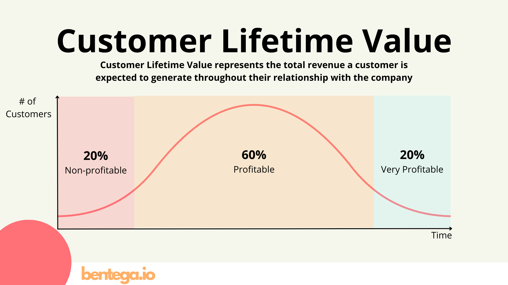
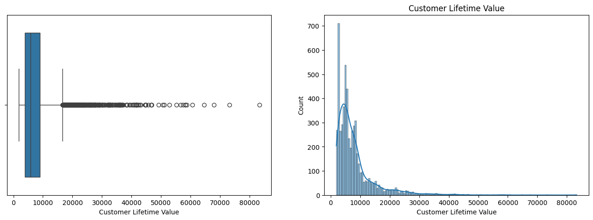
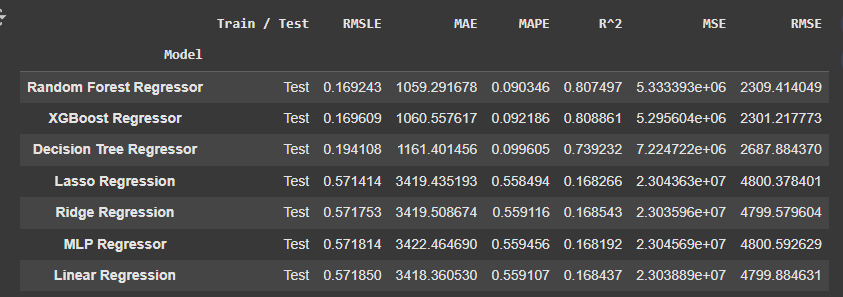
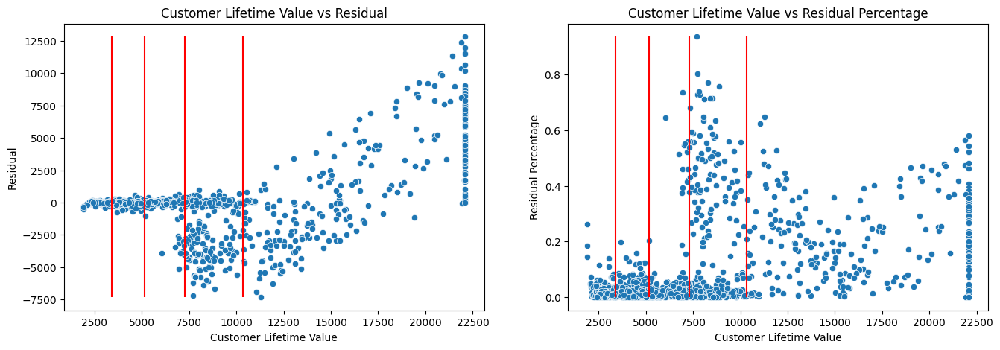

# Customer Lifetime Value

Customer lifetime value, or CLV, is a measure of how valuable a customer is to a company. From this value, the company can determine how much profit is obtained from one passenger and the costs incurred to acquire or retain new customers. This number is quite important for a company to know if the company wants to target marketing to valuable customers effectively and how the company's customers will change in the future.

## Dataset Features
- Vehicle Class
- Coverage
- Renew Offer Type
- Employment Status
- Marital Status
- Education
- Number of Policies
- Monthly Premium Auto
- Total Claim Amount
- Income
- Customer Lifetime Value

Reference: https://www.bentega.io/blog/customer-lifetime-value-understanding-and-optimizing-clv-in-saas

`Customer Lifetime Value` can be theoritically divided into 3 groups by quantile
- Low (Non-profitable) 20% (<=20)
- Medium (Profitable) 60% (20-80)
- High (Very Profitable) 20% (>80)

Customer Lifetime Value (CLV) prediction is crucial for businesses as it helps identify the most valuable customers,
optimize marketing spend by targeting potential higher CLV customers, improve customer retention strategies, and forecast future revenue.

Key Stakeholders:
- Marketing Department: To segment customers, personalize campaigns, and optimize marketing ROI.
- Sales Department: To prioritize leads and tailor sales approaches based on potential customer value.
- Finance Department: For revenue forecasting, budgeting, and financial planning.
- Product Management: To understand which customer segments are most valuable and inform product development.
- Customer Success/Support: To proactively engage with high-value customers and improve retention.

## Problem Statement and Objectives
Problem Statement:
Predict the Customer Lifetime Value (CLV) for each customer to identify high-value customers and inform strategic business decisions.

Objectives:
1. Develop a predictive model to estimate CLV for individual customers.
2. Identify key factors and features that influence CLV.
3. Provide actionable insights to marketing, sales, and finance teams for customer segmentation, targeted marketing, and revenue forecasting.
4. Evaluate the model's performance and understand its limitations.

## Model and Analysis

* Metrics `RMSLE` choosen as target choosing the best model since the CLV is right skewed and big range numbers (residual `1000` in CLV `2000` and `50000` have significant different impact), the `log` will make the error value more balance between the ranges.
* Metrics `MAPE` and `MAE` choosen as main target interpretation results.

**Training Results**

**Best model: Random Forest Regressor** with lowest `RMSLE`.

Model tends to be more dependable when the prediction is in the lower value area around below 7500, after that the model tends to make overprediction until around 15000 and becomes more underprediction when making bigger predictions Customer Lifetime Value

## Final Conclusion and Recommendations

**1. Final Solution Conclusion:**
* **Model Prediction:**
    * The developed **Random Forest Regressor model** demonstrates strong overall CLV prediction performance, achieving an **MAE of 1059.29**, **MAPE 0.09**, and an **RMSLE of 0.1692** on the test data. This means, on average, the model's proportional prediction error for CLV is approximately `9%`, and its absolute error is around `1059`. These metrics are directly relevant for departments in assessing the accuracy of customer value estimations.
* **Insights Analysis:** Features such as `Number of Policies`, `Monthly Premium Auto`, `Income`, and `Total Claim Amount` have proven to be key drivers of CLV.
    * Higher CLV seems to have `Number of Policies` of 2, with lower than that becomes low CLV, but too many becomes medium group CLV.
    * The bigger `Monthly Premium Auto`, `Income`, and `Total Claim Amount` tends to lead the bigger CLV.
    * Customer Segmentations:
        * Customers with high clv tends to be `Employed`, higher `Income`, and have `Luxury`, `Sports`, `SUV` vehicle.
        * Customers with low clv tends to be `Unemployed` & `Retired`, `Divorced`, lower `Income`, and have `Four-door` vehicle.
        * Customers with medium clv are transistion between high and low clv customers characteristics with highest `Disabled` and `Married`.
    * Customer -> Product Analysis:
        * In the same customer group **Medium** and **High CLV**, higher CLV comes with:
            * higher `Extended` and more significant in `Premium` `Coverage`
            * Lower `Number of Policies`
            * More `Monthly Premium Auto` and `Total Claim Amount`
            * More `Offer4` of `Renew Offer Type`
            * But also bigger percentage `Residual Percentage` of roughly around `16%` compares to medium CLV around `7%`
        * In the same customer group **Low** and **Medium CLV**, higher CLV comes with:
            * higher `Extended` and `Premium` `Coverage`
            * More `Number of Policies`, `Monthly Premium Auto`
            * More `Offer1` of `Renew Offer Type`
            * But also bigger percentage `Residual Percentage` of roughly around `11%` compares to low CLV around `3%`

**2. Recommendations for When the Model is Good and Not Good to Use (Model Trustworthiness):**

* **Model Can Be Trusted (Good to Use):**
    * **For Predicting Low to Medium CLV (e.g., below the 0.6 quantile or around 7,500):** In this range, residual plots show the model is highly accurate and consistent. Predictions for these segments can be relied upon for standard customer retention and development strategies.
    * **For Identifying CLV Drivers:** SHAP plots provide very clear insights into the key features influencing CLV. This information can be utilized by product, marketing, and sales teams to shape strategies for increasing customer value and improving products/services.
    * **For Initial Segmentation and Targeting:** The model can help identify distinct customer segments based on their potential value, which is a good starting point for targeting strategies.

* **Model Is Less Trustworthy (Use with Caution):**
    * **For Highly Accurate Point Predictions on High CLV (especially above the 0.8 quantile or around 10,000, approaching the 22,500 capping limit):** The model consistently **underpredicts** CLV for high-value customers. Both absolute and percentage errors become significantly larger in this segment. Therefore, do not over-rely on single-point predictions for very high CLV customers from this model. **Predictions in this segment should be treated as minimum estimates**.
    * **When Extrapolation is Required:** As Random Forest is not designed for extrapolation, the model will not accurately predict CLV values far beyond what was seen in the training data, even if theoretically, such customers have higher potential value.

**3. Impact of Solution Implementation on Business Processes:**

In Overall, by doing simulation of CLV prediction for same customer groups to have in average the same products like its higher CLV groups, predicted future revenue increased by `6634680.63` `(14.57%)` with targeting `25.87%` of low CLV customer group and `24.06%` of medium CLV customer group. It can be applicable for example:
* **Marketing:** Enables personalized customer segmented campaigns based on CLV predictions, more efficient budget allocation to high-potential segments such as focus more on customer segment with `Luxury`, `Sports`, `SUV` vehicles and `Employed` and higher `Income`.
* **Sales:** Prioritizes leads or customers predicted to have high CLV and upsell targeting `Number of Policies` of 2.
* **Product/Service Management:** Informs decisions on product development or feature enhancements most likely to increase CLV, based on value-driving features. Prioritize product with `Offer4` compare to `Offer1` and `Premium` `Extended` Coverage rather than `Basic`.
* **Finance & Strategy:** Provides more accurate revenue projections and enables more strategic resource allocation based on future customer value estimates.

**4. Project Limitations and Recommendations for Future Improvement:**

* **Data Limitations:**
    * **Historical Data Availability:** Assumes that the data used consists of static features. If no deep historical transaction or interaction data is available (e.g., purchase frequency, relationship duration), the model might miss crucial signals for more accurate CLV, customer CLV projections, and churn predictions.

* **Model Limitations (Random Forest Regressor):**
    * **Extrapolation Limitation:** Random Forest, as a tree-based model, is inherently incapable of extrapolating values beyond the range of its training data. This contributes to the underprediction for very high CLV customers who might represent extreme cases.

* **Recommendations for Future Improvement:**
    1.  **Additional Features:**
        * **Temporal/History Features:** If historical customer data is available (e.g., claims amount per year, premium changes over time), leverage it to create richer features.
        * **Customer ID:** for better understanding specific customer behavior along the time like **Churn**, **CLV Trends / Average**, **Policy**, etc.
        * **More Customer Features:** like **location**, **age**, **gender**, etc. for more specific customer segmentation
        * **More Product Features:** like **policy** to enrich product related insights, combined with customer features can lead to open up more detail customer -> product related strategies
    2.  **External Validation:** Perform model validation with new data from different time periods to ensure model stability and generalization in the future.